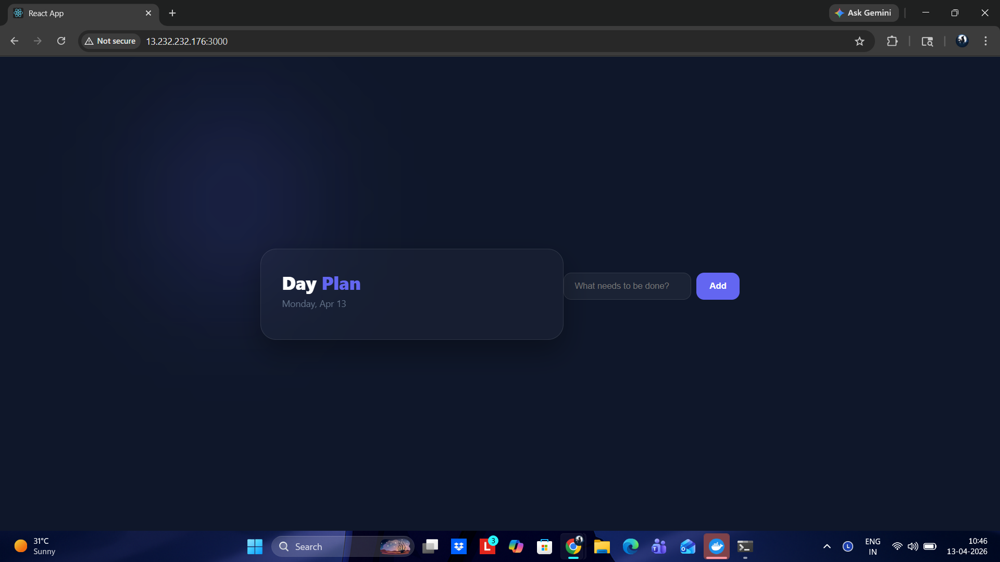
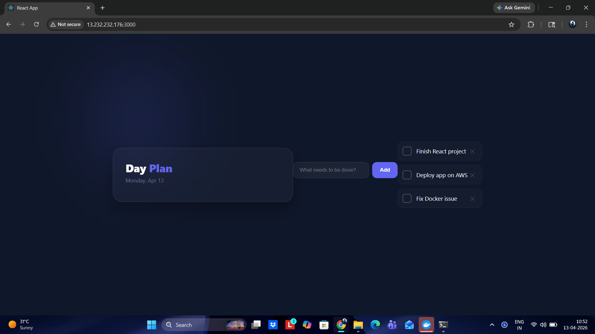
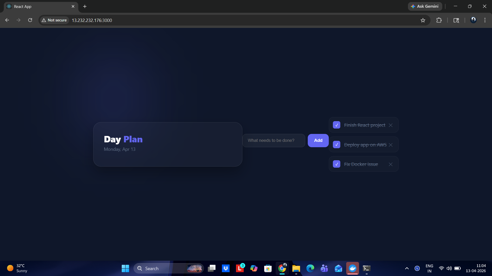
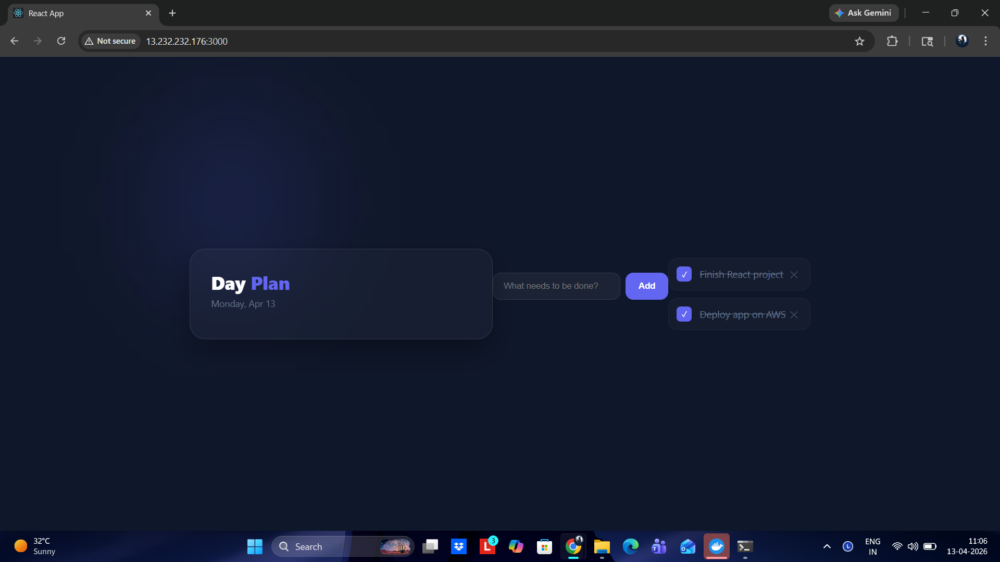
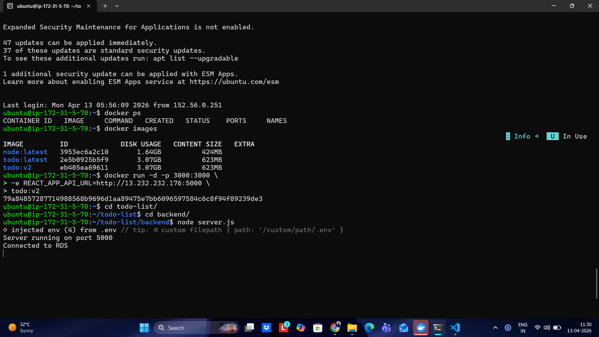
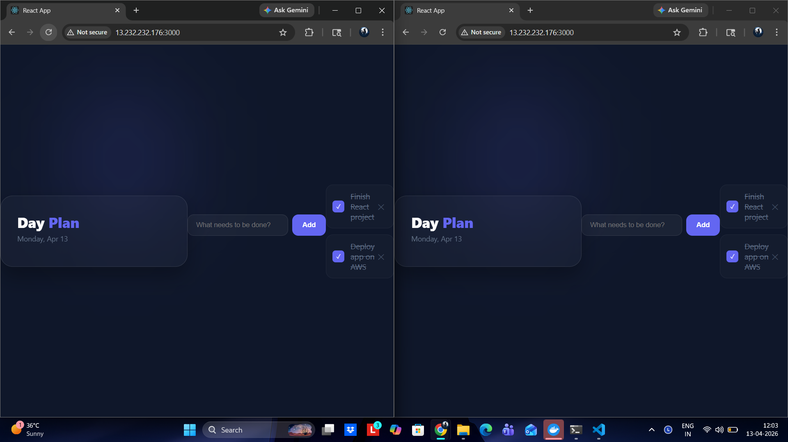
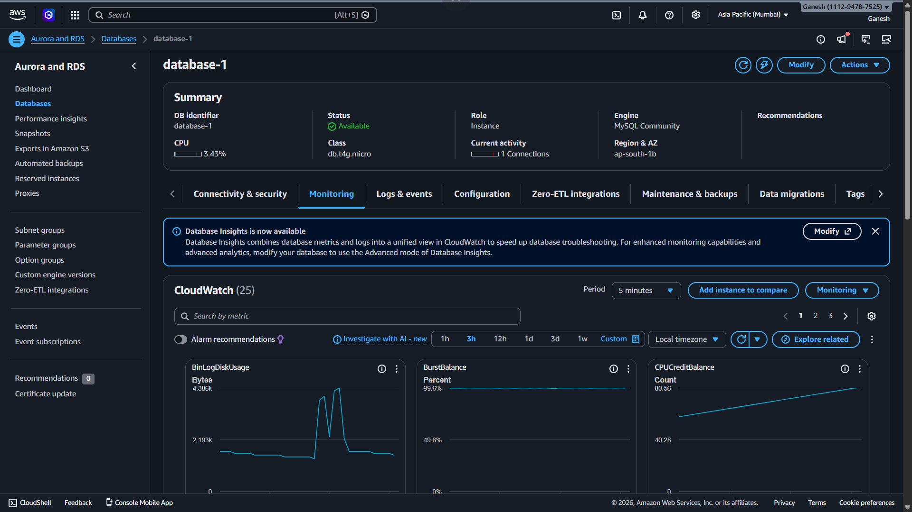

# 📝 Full Stack To-Do App

A modern full-stack To-Do application built with **React, Node.js, MySQL (AWS RDS), Docker, and AWS EC2**.


---

## 🚀 Features

* ✅ Add new tasks
* ✅ Mark tasks as completed
* ✅ Delete tasks
* 🔄 Data persistence using AWS RDS
* ☁️ Deployed on AWS EC2
* 🐳 Dockerized frontend

---

## 🏗️ Architecture

```text
React (Frontend - Docker)
        ↓
Node.js (Backend - EC2)
        ↓
MySQL (AWS RDS)
```

---


## 🛠️ Setup Instructions

### 1️⃣ Clone Repository

```bash
git clone https://github.com/your-username/todo-app.git
cd todo-app
```

---

## 🔐 Environment Variables

### Backend (`backend/.env`)

```env
DB_HOST=your-rds-endpoint
DB_USER=your-username
DB_PASSWORD=your-password
DB_NAME=todo_db
```

---

### Frontend (`src/.env`)

```env
REACT_APP_API_URL=http://your-ec2-ip:5000
```
---

### This repository contains automation scripts for deploying both **backend** and **frontend** services.

## 📁 Automation

```
.
├── backend_deploy.sh     # Script to deploy backend
├── frontend_deploy.sh    # Script to deploy frontend
```


2. Give execute permissions to scripts:

```bash
chmod +x backend_deploy.sh
chmod +x frontend_deploy.sh
```

---

## 🚀 Usage

### Deploy Backend

```bash
./backend_deploy.sh
```

---

### Deploy Frontend

```bash
./frontend_deploy.sh
```

---

## 🌐 API Endpoints

| Method | Endpoint     | Description   |
| ------ | ------------ | ------------- |
| GET    | `/todos`     | Get all todos |
| POST   | `/todos`     | Add todo      |
| PUT    | `/todos/:id` | Update todo   |
| DELETE | `/todos/:id` | Delete todo   |

---

## 📸 Screenshots

### 🏠 Home UI



---

### ➕ Add Task



---

### ✅ Mark as Completed



---

### 🗑 Delete Task




---

### ⚙️ Backend Running on EC2

Node.js server connected to AWS RDS.



---

### ⚙️ perrsistence

Node.js server connected to AWS RDS.



---

### ⚙️ AWS RDS Dashboard

AWS RDS dashboard.



---

## ⚠️ Common Issues

### Failed to fetch

* Check API URL
* Ensure backend is running
* Verify EC2 ports are open

### MySQL connection error

* Verify `.env` credentials
* Check RDS security group

---

## 👨‍💻 Author
**Ganesh**
